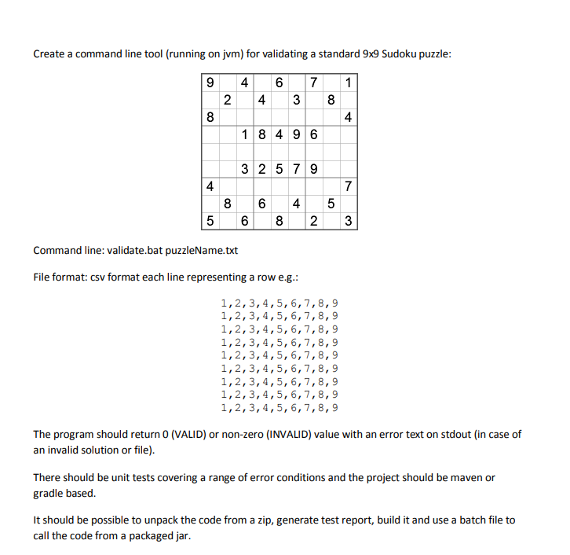

# Sudoku puzzle validator


***
Standalone application [just logback and slf4j] which checks if puzzles from file are correctly resolved. Limitations:

* matrix size is 9x9
* each line represents row
* cells are separated by default by comma
* exists just one puzzle in the file
* puzzle contains all numbers defined, lack of any is recognized as invalid
* just numbers from <1,9>, number around " ' is considered as invalid
* not text file is considered as invalid
* buy default file larger than 100x100 bytes is considered as invalid

## How build, test and run

***
To prepare fat jar, zipped distribution and run tests execute:

```
.\mvnw clean verify
```

or use "Sudoku [verify]" from Run Configuration Result:

* distribution zipped -> ./target/distribution.zip
* distribution unzipped -> ./target/distribution/

To generate test report run:

```
.\mvnw clean surefire-report:report
```

or use "Sudoku [surefire-report:report]" from Run Configuration Result:

* tests -> ./target/site/surefire-report.html

To run script go to:

* distribution unzipped directory and run validate.bat X where X is a path to text file in csv format.

```
validate.bat [FILE]
where
FILE - path to text file containing sudo puzzle solution
available env properties to set up:
SUDOKU_MAX_FILE_SIZE  - max file size 
SUDOKU_MIMETYPES  - mime types validation
SUDOKU_SEPARATOR  - separator
```

or use "validate from distribution" from Run Configuration

